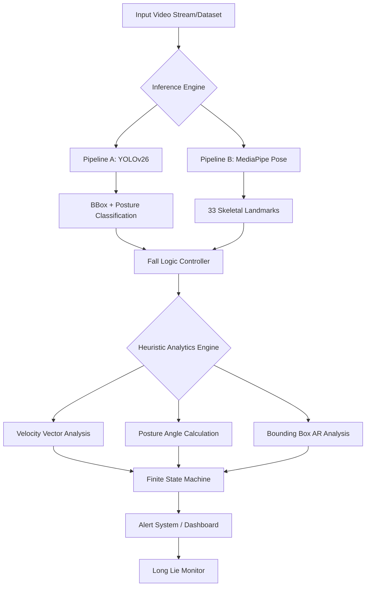

# System Architecture: Patient Safety Automation (Distinction-Level Design)

## 1. High-Level Design
The system implements a **dual-pipeline inference engine** designed for comparative benchmarking between frame-level object detection (YOLOv26) and coordinate-based pose estimation (MediaPipe). This architecture is specifically engineered to address the "Trilemma" of healthcare AI: **Accuracy**, **Latency**, and **Privacy**.

## 2. Mathematical Fall Detection Model (Original Contribution)

To minimize False Positive Rates (FPR), a multi-modal heuristic is implemented. A fall event $F_t$ at time $t$ is triggered if a conjunction of conditions is met within a temporal window $\Omega$.

### 2.1 Vertical Displacement and Velocity ($\Delta y, V_y$)
We track the vertical coordinate of the body centroid (YOLO) or the midpoint of the hips (MediaPipe), denoted as $y_t$.
The vertical velocity $V_y$ is calculated as:
$$V_y = \frac{y_t - y_{t-1}}{\Delta t}$$
A fall is flagged if $V_y > \tau_{velocity}$, where $\tau_{velocity}$ represents a sudden downward spike (typically $> 2.5$ m/s in real-world equivalents).

### 2.2 Posture Angle ($\Theta$)
The body orientation is calculated using the vector $\vec{V}_{trunk}$ between the neck ($N$) and the midpoint of the hips ($H$):
$$\Theta = \arccos\left(\frac{\vec{V}_{trunk} \cdot \vec{V}_{horizontal}}{|\vec{V}_{trunk}|}\right)$$
- **Standing/Walking**: $\Theta \approx 90^\circ$
- **Fallen**: $\Theta < 30^\circ$ (Relative to ground)

### 2.3 Bounding Box Aspect Ratio ($AR$)
The aspect ratio of the bounding box is a critical proxy for posture:
$$AR = \frac{Width}{Height}$$
A sustained $AR > 1.2$ indicates a horizontal posture, distinguishing a fall from a crouch.

### 2.4 "Long Lie" Logic (Temporal Threshold)
A fall is only confirmed if the "Static State" persists for $X$ seconds:
$$\sum_{i=t}^{t+X} |y_i - y_{t}| < \epsilon$$
This filter differentiates a dynamic fall from a purposeful action like sitting down or picking up an object.

## 3. Comparative Methodology and Justification
- **YOLOv26 (Pipeline A)**: Justified for its ability to learn complex visual features (e.g., occlusion by blankets) which skeleton models might miss.
- **MediaPipe (Pipeline B)**: Justified for its privacy-preserving nature (storing only 33 floats instead of raw video) and its superior performance on CPU-only hardware.

## 4. Hardware Simulation (Edge-Ready)
The system is optimized for **Intel Core i5/i7 (CPU-only)** to simulate the resource constraints of real-world elderly care facilities. Optimization techniques include:
- **Quantization**: Converting weights to FP16/INT8.
- **Frame Skipping**: Processing every $n$-th frame to maintain real-time alerts.
